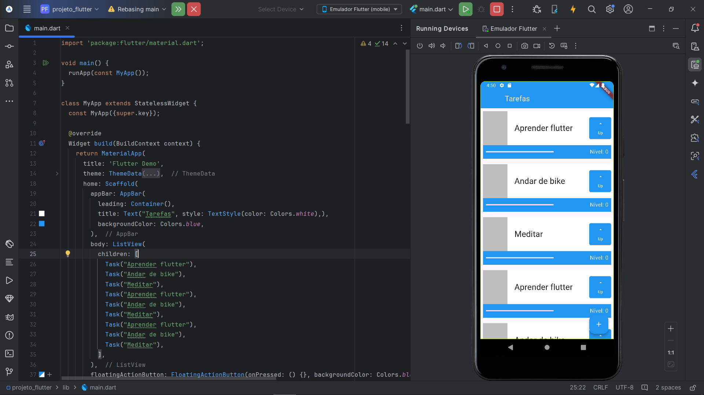
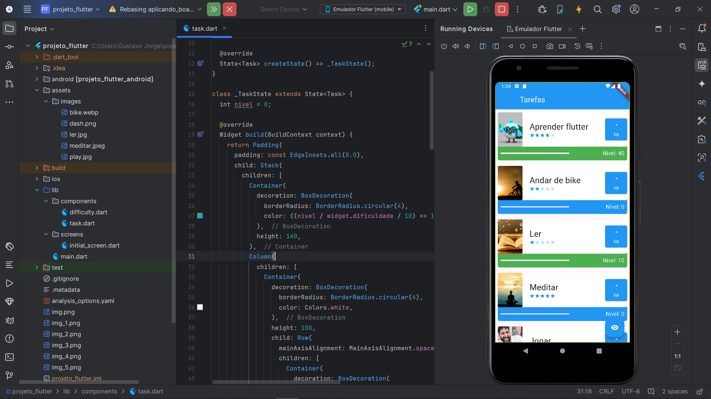

# Atividade referente a Sprint4 - "Aplicando boas práticas".

Segue a atividade abaixo do projeto de Todo List que foi feita durante as aulas. Agora, **refatorado e com efeito de 'concluído'**.

- Primeira Versão:

- Segunda versão:

- Terceira versão:

